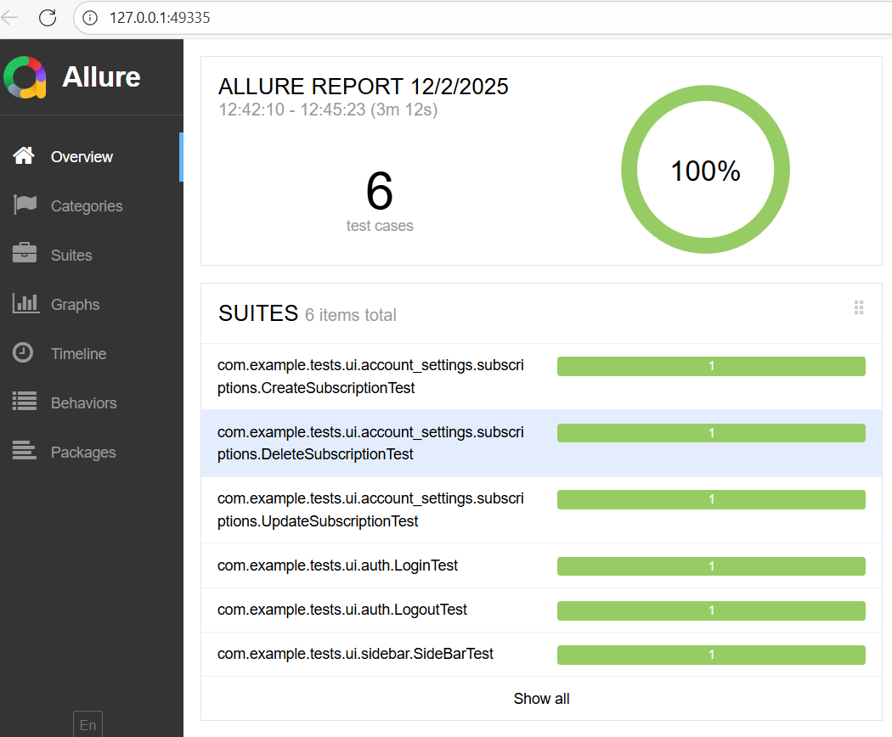

## **UI Automation Tests for servers.com Portal**

This repository contains UI automated tests for the web portal https://portal.servers.com/
.
The project was developed as part of a technical assignment and covers key portal functionality, including sidebar navigation, account settings, subscription management (CRUD), form validation, and more.

**Tech Stack**

| Technology         | Purpose                      |
|--------------------|------------------------------|
| Java 17+           | Main programming language    |
| Selenide           | UI test automation framework |
| Selenium WebDriver | Browser automation           |
| JUnit 5            | Test framework               |
| Owner              | Configuration management     |
| Lombok             | Reduces boilerplate code     |
| WebDriverManager   | Manages browser drivers      |
| Maven              | Build and test runner        |
| Allure             | Reporting                    |

## How to Run Tests

### 1. Run all tests
```
mvn clean test 
```

### 2. Run a single test class
```
mvn -Dtest=LoginTest test  
mvn -Dtest=LogoutTest test 
mvn -Dtest=SideBarTest test
mvn -Dtest=CreateSubscriptionTest test 
mvn -Dtest=DeleteSubscriptionTest test 
mvn -Dtest=UpdateSubscriptionTest test 
```

## **Credentials**
If you have login and password, you can enter them in `config.properties` file. For example,
```declarative
email=your_email
password=your_password
```


## Allure Reporting
This project uses Allure to generate test reports.
To view Allure reports locally, you need to install the Allure Command-Line Interface:

### 1. Install Allure CLI


Download the latest ZIP from the official Allure releases:
https://github.com/allure-framework/allure2/releases

Extract it, for example to:
```
C:\allure
```

Add the bin directory to your system PATH:
```
C:\allure\bin
```


Restart the terminal and check installation:
```
allure --version
```

### 2. Run tests and generate Allure results
```   
mvn clean test
```

Allure results will be saved in:
```
target/allure-results
```

### 3. Generate and open Allure report
```   
allure serve target/allure-results
```


This command will open the Allure report in your browser.

Example Allure report

